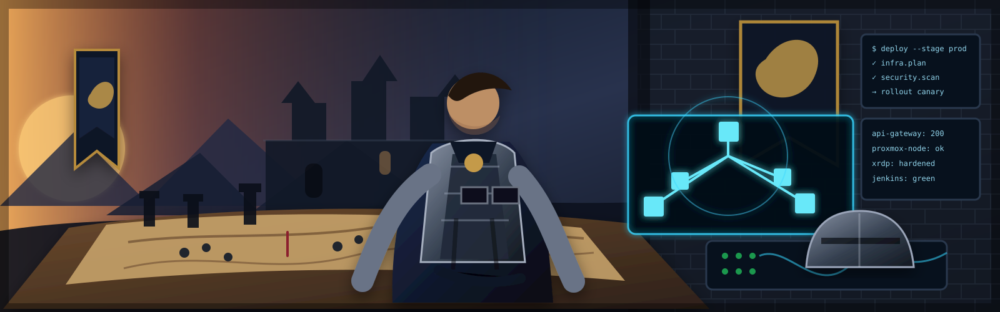

<div align="center">



[](https://joevisualstoryteller.github.io/joevisualstoryteller)
[](https://react.dev)
[](https://www.typescriptlang.org)
[](https://vitejs.dev)

**A battle-forged portfolio — where medieval craft meets military precision and modern engineering.**

[⚔️ Enter the Stronghold](https://joevisualstoryteller.github.io/joevisualstoryteller) • [🐉 Report a Dragon](https://github.com/JoeVisualStoryteller/joevisualstoryteller/issues) • [📯 Request Feature](https://github.com/JoeVisualStoryteller/joevisualstoryteller/issues)

</div>

---

## ⚔️ The Arsenal


---

## 🏰 The Stronghold

A personal portfolio built to spec — clean, fast, and deployed to GitHub Pages.

- ⚔️ **Command Center** — Hero section with designation and mission brief
- 📋 **Dossier** — Background, career stats, and operational history
- 🛡️ **Armory** — Technical skills across AI, cloud, automation, security, and infrastructure

**Joseph H. Dunn II** — Systems Engineer & Digital Tactician with 10+ years commanding cloud infrastructure (AWS, Azure, GCP) and deploying AI-augmented automation across military and enterprise domains.

> *"I forge not mere systems, but legends that inspire kingdoms yet to come."*

---

## 🗝️ Deploy the Fortress

```bash
git clone https://github.com/JoeVisualStoryteller/joevisualstoryteller.git
cd joevisualstoryteller
npm install
npm run dev
```

**Field Commands:**
- `npm run dev` — Spin up the local forge
- `npm run build` — Compile for deployment
- `npm run deploy` — Push to GitHub Pages

---

## 📯 Contact the Operator

**Joseph H. Dunn II** — Systems Engineer & Digital Tactician

📧 jdunn0423@gmail.com | 🌐 [Portfolio](https://joevisualstoryteller.github.io/joevisualstoryteller) | 💼 [LinkedIn](https://www.linkedin.com/in/josephdunn0423)

---

<div align="center">

```
╔═════════════════════════════════════════════════════╗
║                                                     ║
║      ⚔️  Forged in the Fires of Innovation  ⚔️       ║
║                                                     ║
║   "Transforming chaos into elegant order since      ║
║           the Year of Our Code 2012"                ║
║                                                     ║
╚═════════════════════════════════════════════════════╝
```

[](https://github.com/JoeVisualStoryteller/joevisualstoryteller)

*May your builds be clean and your deployments swift.*

</div>
